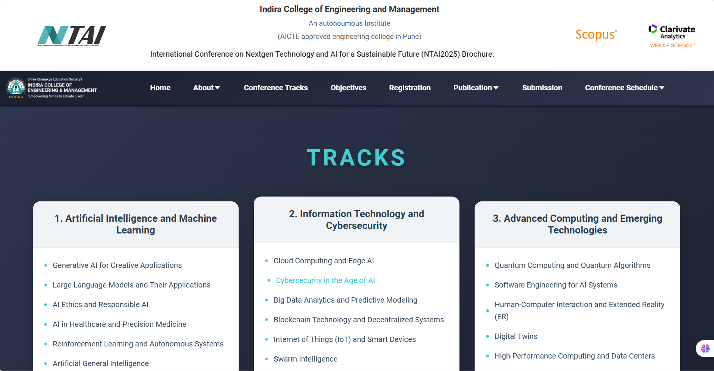

# 🎤 Conference Website

A modern and responsive conference website built using **React.js** (via Create React App). This site is designed to showcase event details, speaker profiles, schedules, and registration info for tech or academic conferences.

## 🚀 Features

- 🖥️ Fully responsive design
- 📅 Dynamic conference schedule section
- 🧑‍💼 Speaker profiles with bios and photos
- 📝 Registration form (customizable)
- 🌐 SEO-friendly structure
- 📸 Image-rich content layout using CSS utility classes

---

## 🛠️ Getting Started

This project was bootstrapped with [Create React App](https://github.com/facebook/create-react-app).

### Prerequisites

- Node.js (>= 14.x)
- npm or yarn

### Installation

```bash
git clone https://github.com/VikasPrasad27/NTAI2025.git
cd NTAI2025
npm install
npm start
```
## 📸 Screenshots

### 🏠 Home Page


### 🗓️ Track Page


### 🧑‍🏫 Objectives Page


## Designed and Developed By : Vikas Prasad

